# CloudGuard integration with CICD pipeline on AWS Codepipeline

While serverless functions are becoming more and more popular with cloud-native application developments, we've also started seeing  security challenges that come with the hype. Serverless applications are also at risk of [OWASP top ten application vulnerabilities](https://owasp.org/www-project-serverless-top-10/) because they will still execute code. If the code is written in a manner that doesn't follow security best practices, or if the function is using excessive permissions, they can be vulnerable to a wide range of security attacks.

In this tutorial, I'll do a walk-thorugh of how we can use CloudGuard workload protection to secure your serverless applications. CloudGuard workload protection can assess your Lambda code for vulnerabilties and embedded credentials, excessive permissions, and enable active protection/workload firewall for your serverless workloads. 

This project contains source code (zip) and supporting files for a serverless application that you can deploy with the command line interface (CLI) and scripts. We're gonna deploy a sample serverless application. Let's get started

#Pre-requisites
You need the following tools on your computer:

* AWS CLI [Install AWS CLI](https://docs.aws.amazon.com/cli/latest/userguide/cli-chap-install.html).
* AWS SAM CLI - [Install the AWS SAM CLI](https://docs.aws.amazon.com/serverless-application-model/latest/developerguide/serverless-sam-cli-install.html).
* Node.js - [Install Node.js 12](https://nodejs.org/en/), including the npm package management tool.
* Docker - [Install Docker community edition](https://hub.docker.com/search/?type=edition&offering=community).

### CloudGuard CSPM Account

* CloudGuard Account (https://secure.dome9.com/v2)
* CloudGuard API and API Secret 

AWS roles needed to be created for the following services:

* CodeCommit
* CodeBuild
* CodeDeploy
* CodePipeline
* Lambda Function 

The roles will be created as part of creating a codepipeline. Please take note that the role used by codebulid requires permission to access to a number of AWS resources such as S3. 

## What exactly we will be doing

We'll need to do the followings;

1. Create AWS CodeCommit repo \
(Yes if you'd like to follow along my ALL-AWS tutorial, you'll need to create a CodeCommit repo which will be used in CICD pipeline. In this Github repo, I've uploaded Nodejs application source code zip file, buildspec.yml, and other scripts)
2. Deploy the serverless application using SAM
3. Create a Codepipeline
4. Integrate CloudGuard to protect the serverless app at build stage
5. Test Your CodePipeline - Observe that any change in the codecommit repo will trigger the pipeline, and in the build stage, CloudGuard will be enabled and integrated to the serverless application
6. Verification of CloudGuard protection - Verify that Proact and FSP for the serverless application are enabled on the CloudGuard console.

## 1. Create a CodeCommit Repository
First you'll need to create a Codecommit on AWS. You can do it on AWS web console or you can just execute the following command.

```bash
aws codecommit create-repository --repository-name cloudguard-serverless-cicd-codepipeline --repository-description "CloudGuard Serverless CICD Pipeline Demo Pipeline"
```

Then you'll need to do 'git clone your codepipline reop' via either SSH or HTTP.  It'll be an empty repository first. Then you will need to download the soure files (zip) into your local repo [here](https://github.com/jaydenaung/cloudguard-serverless-cicd-codepipeline/blob/master/dev-serverless.zip) 

- Unzip the source files (It will create a folder. You'll need to move the files from that folder to root directory.)
- Remove the zip file (and the empty folder)


- Download the following files from this GitHub repo to your CodeCommit local directory.

1. buildspec.yml
2. sam_deploy.sh
3. cloudguard-config.json 
4. my-pipeline.json (Optional)
5. You may add .gitignore & README.md if you'd like

- Then you'll need to do `git init`, `git add -A`, `git commit -m "Your message"` and `git push`

You should see the following files and folders in your **CodeCommit Repo**. 

```bash
$ ls
README.md              node_modules           template.yml
__tests__              cloudguard-config.json    
buildspec.yml          my-pipeline.json       package.json           src
$
``` 

You'll need to create an S3 bucket.

```bash
aws s3 mb s3://Your-Bucket-Name
```


### 2. Deploy the serverless application user [sam_deploy.sh](https://github.com/jaydenaung/cloudguard-serverless-cicd-codepipeline/blob/master/sam_deploy.sh)

Download the sam_deploy.sh script from this git repo to your local directory, and run it. 

```bash
./sam_deploy.sh
```

Expected output:

```
./sam_deploy.sh
Enter S3 Bucket Name: chkp-jayden-serverless-apps-source
Enter Your CFT Stack Name: chkp-jayden-dev-serverless-app
[Task 1] Packaging your serverless application based on template.yml
Uploading to c3e4be0a0b3cbe688e90f2b571a38f47  373 / 373.0  (100.00%)

Successfully packaged artifacts and wrote output template to file out.yml.
Execute the following command to deploy the packaged template
sam deploy --template-file /Users/jaydenaung/git/serverless/dev-serverless-repo/out.yml --stack-name <YOUR STACK NAME>

[Task 2] Deploying your application now..

	Deploying with following values
	===============================
	Stack name                 : chkp-jayden-dev-serverless-app
	Region                     : None
	Confirm changeset          : False
	Deployment s3 bucket       : None
	Capabilities               : ["CAPABILITY_IAM"]
	Parameter overrides        : {}

Initiating deployment
=====================

Waiting for changeset to be created..

CloudFormation stack changeset
---------------------------------------------------------------------------------------------------------------------------------------------------------------------------
Operation                                                 LogicalResourceId                                         ResourceType                                            
---------------------------------------------------------------------------------------------------------------------------------------------------------------------------
+ Add                                                     helloFromLambdaFunctionRole                               AWS::IAM::Role                                          
+ Add                                                     helloFromLambdaFunction                                   AWS::Lambda::Function                                   
---------------------------------------------------------------------------------------------------------------------------------------------------------------------------

Changeset created successfully. arn:aws:cloudformation:ap-southeast-1:116489363094:changeSet/samcli-deploy1601635751/a1274a36-42d3-4225-b021-cb3c1fc5d839


2020-10-02 18:49:22 - Waiting for stack create/update to complete

CloudFormation events from changeset
-------------------------------------------------------------------------------------------------------------------------------------------------------------------------
ResourceStatus                             ResourceType                               LogicalResourceId                          ResourceStatusReason                     
-------------------------------------------------------------------------------------------------------------------------------------------------------------------------
CREATE_IN_PROGRESS                         AWS::IAM::Role                             helloFromLambdaFunctionRole                -                                        
CREATE_IN_PROGRESS                         AWS::IAM::Role                             helloFromLambdaFunctionRole                Resource creation Initiated              
CREATE_COMPLETE                            AWS::IAM::Role                             helloFromLambdaFunctionRole                -                                        
CREATE_IN_PROGRESS                         AWS::Lambda::Function                      helloFromLambdaFunction                    -                                        
CREATE_IN_PROGRESS                         AWS::Lambda::Function                      helloFromLambdaFunction                    Resource creation Initiated              
CREATE_COMPLETE                            AWS::Lambda::Function                      helloFromLambdaFunction                    -                                        
CREATE_COMPLETE                            AWS::CloudFormation::Stack                 chkp-jayden-dev-serverless-app             -                                        
-------------------------------------------------------------------------------------------------------------------------------------------------------------------------

Successfully created/updated stack - chkp-jayden-dev-serverless-app in None

Your serverless application has been deployed.
```

Now that your cloudformation stack has been deployed, you also have a Lambda function now. You can test the Lambda fucntion on AWS web console. 

We'll need the ARN of the cloudformation stack as well. Go to AWS Web Console => Cloudformation => Stacks, and take note the ARN of the stack that has just been created. (It looks like this:  arn:aws:cloudformation:ap-southeast-1:116489363094:stack/chkp-serverless-app/a6d77c70-048a-11eb-8438-02e7c9cae2dc)

## buildspec.yml

In the buildsepc.yml, replace the following values with your own (without []):

1. AWS_REGION=[Your REGION]
2. S3_BUCKET=[YOUR BUCKET NAME]
3. cloudguard fsp -c [The ARN of Your Cloudformation stack you just took note of]

```
version: 0.2

phases:
  install:
    commands:
      # Install all dependencies (including dependencies for running tests)
      - npm install
      - pip install --upgrade awscli
  pre_build:
    commands:
      # Discover and run unit tests in the '__tests__' directory
      #- npm run test
      # Remove all unit tests to reduce the size of the package that will be ultimately uploaded to Lambda
      #- rm -rf ./__tests__
      # Remove all dependencies not needed for the Lambda deployment package (the packages from devDependencies in package.json)
      #- npm prune --production
  build:
    commands:
      # Install the CloudGuard Workload CLI Plugin
      - npm install -g https://artifactory.app.protego.io/cloudguard-serverless-plugin.tgz
      # Set your AWS region variable
      - export AWS_REGION=[Your REGION]
      # Configure the CloudGuard Workload Proact security on the SAM template
      - cloudguard proact -m template.yml
      # Set the S3 bucket name variable
      - export S3_BUCKET=[YOUR BUCKET NAME]
      # Use AWS SAM to package the application by using AWS CloudFormation
      - aws cloudformation package --template template.yml --s3-bucket $S3_BUCKET --output-template template-export.yml
   # commands:
      # Add the FSP Runtime security to the deployed function. Please replace with the function cloudformation arn!
      - cloudguard fsp -c [The ARN of Your Cloudformation stack you just took note of]
artifacts:
  type: zip
  files:
    - template-export.yml
```

## 3. Create a Codepipeline

Now if you're like me who likes to do things using CLI, you can edit "my-pipeline.json" which you can find in this repo, and execute the following CLI.

```bash
aws codepipeline create-pipeline --cli-input-json file://my-pipeline.json
```

Otherwise, please follow the step-by-step guide to create a Codepipeline.

### Codepipeline - Initial setting

Now that we have a  let's create a codepipeline.

1. Go to "Codepipeline" on AWS console
2. Create Pipeline
3. Enter your pipeline's name
4. If you already have an existing role, choose it. Or create a new role.

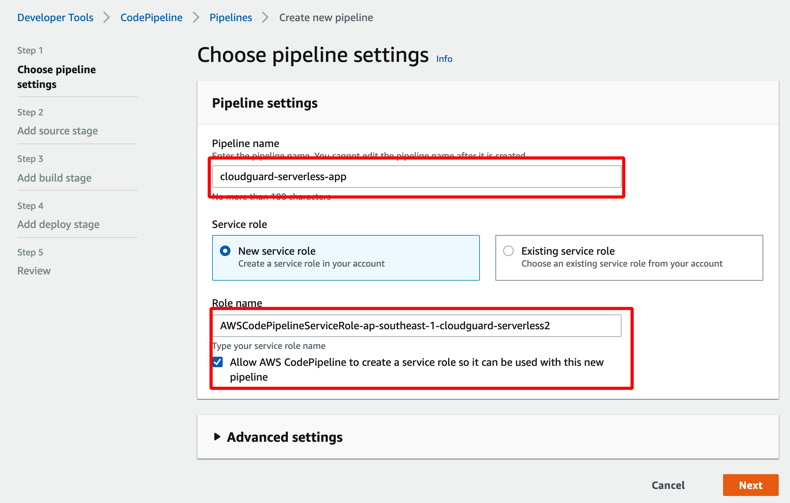 

### Codepipeline - Source
Then we can add source.

1. Choose "CodeCommit" (You can use Github or any code repo. If you're following along my tutorial, choose CodeCommit.)
2. Choose Repository name - the CodeCommit repo that you've created earlier.
3. Choose Master Branch
4. For change detection, Choose "CloudWatch Events".

 

### Codepipeline - Build Stage
We need to configure the build environment.

1. Choose "CodeBuild" & choose your region.
2. If you don't already have a codebuild project, choose "Create Project".


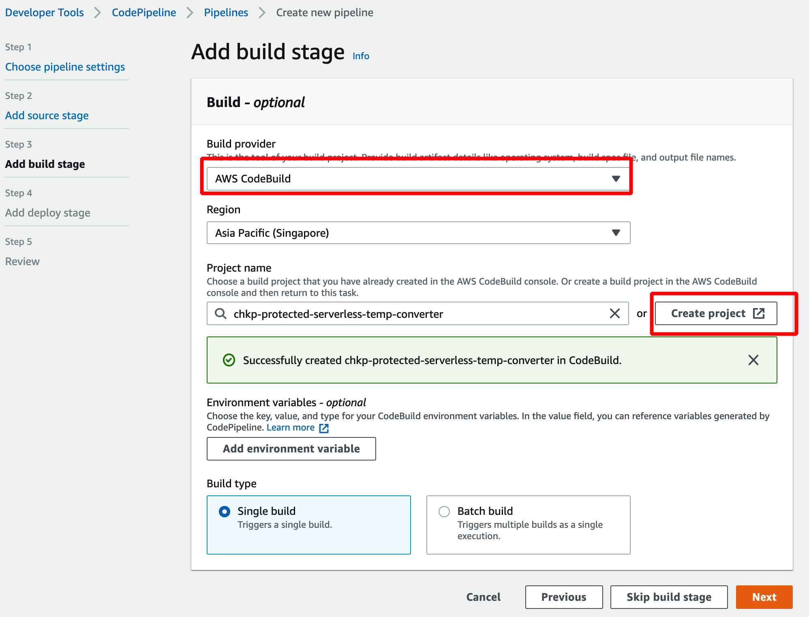 

In CodeBuild windows, do the following;

1. Enter your project name
2. Choose "Managed Image" and "Ubuntu" as Operating system

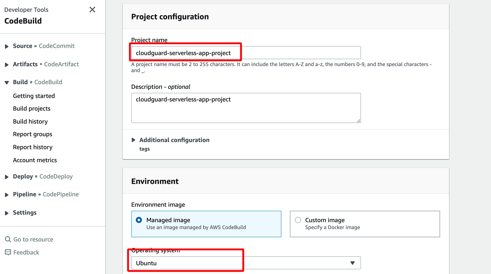 

3. Choose "Standard" & "Standard:3.0" (It's totally up to you to choose actually. But this setting works for Nodejs 12.x apps)
4. Check "Privileged ...." checkbox
5. Choose an existing role or create a new service role.


> Now, please take note that codebuild role requires permissions to access a number of AWS services including Lambda, Cloudformation template and IAM. You will encounter issues while Codebuild is building the app.


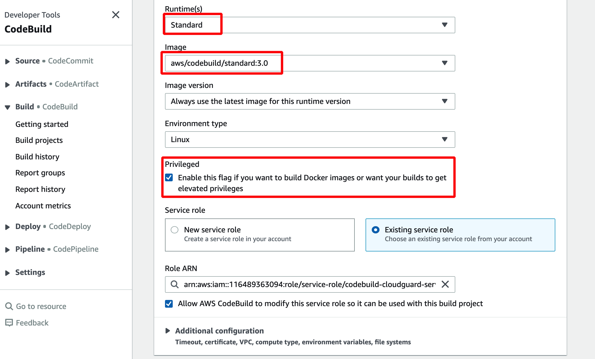 

### Codepipeline - Deploy Stage 

In Deploy stage, we'll have to do the following;

1. Choose "Cloudformation" as Deploy Provider 
2. Choose your region
3. Action mode: "Create or update a stack" (You can also use ChangeSet)
4. Stack Name: **Choose the CFT Stack that you've created for your Lambda function**
5. As for Artifacts, Enter "template-export.yml" as defined in buildspec.yml.

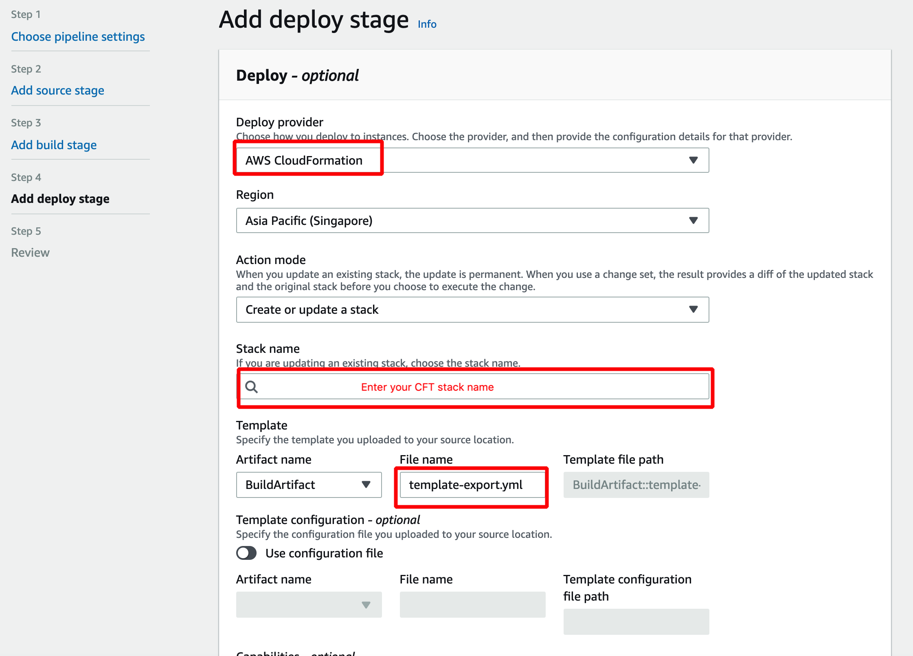 

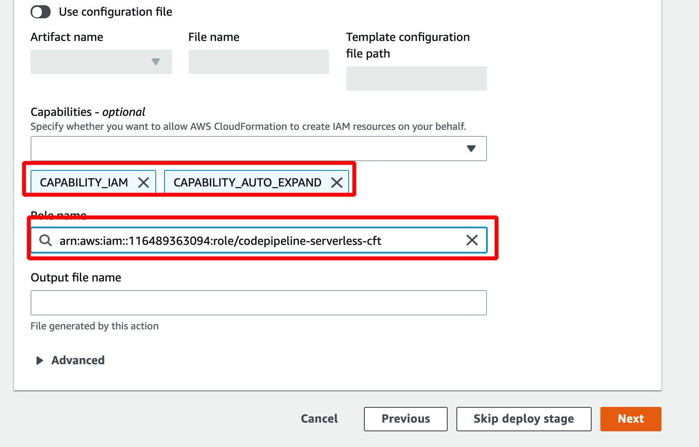 

Your pipeline has been created. Any change in your source code in AWS Codecommit will trigger the pipeline. In build stage, CloudGuard will protect the serverless application by enabling Proact, and FSP which will be added to the Lambda function as a layer.

## 5. Test your Codepipeline - Release Change

You can check and verify that each stage of your CodePipline has been successfully completed!

```bash
[Container] 2020/10/03 02:46:04 Waiting for agent ping
[Container] 2020/10/03 02:46:06 Waiting for DOWNLOAD_SOURCE
[Container] 2020/10/03 02:46:07 Phase is DOWNLOAD_SOURCE
[Container] 2020/10/03 02:46:08 CODEBUILD_SRC_DIR=/codebuild/output/src143388004/src
[Container] 2020/10/03 02:46:08 YAML location is /codebuild/output/src143388004/src/buildspec.yml
[Container] 2020/10/03 02:46:08 Found possible syntax errors in buildspec: 
In the section artifacts
    The following keys cannot be identified:
        type
[Container] 2020/10/03 02:46:08 Processing environment variables
[Container] 2020/10/03 02:46:08 No runtime version selected in buildspec.
[Container] 2020/10/03 02:46:08 Moving to directory /codebuild/output/src143388004/src
[Container] 2020/10/03 02:46:08 Registering with agent
[Container] 2020/10/03 02:46:08 Phases found in YAML: 3
[Container] 2020/10/03 02:46:08  PRE_BUILD: 1 commands
[Container] 2020/10/03 02:46:08  BUILD: 6 commands
[Container] 2020/10/03 02:46:08  INSTALL: 2 commands
[Container] 2020/10/03 02:46:08 Phase complete: DOWNLOAD_SOURCE State: SUCCEEDED
[Container] 2020/10/03 02:46:08 Phase context status code:  Message: 
[Container] 2020/10/03 02:46:08 Entering phase INSTALL
[Container] 2020/10/03 02:46:08 Running command npm install
audited 467 packages in 5.353s

19 packages are looking for funding
  run `npm fund` for details

found 0 vulnerabilities


[Container] 2020/10/03 02:46:19 Running command pip install --upgrade awscli
Collecting awscli
  Downloading https://files.pythonhosted.org/packages/11/7a/1f483d74fbf9d20f5e82849031b5adb59896b8e4ffcbf9c35040200edd81/awscli-1.18.152-py2.py3-none-any.whl (3.4MB)
Requirement already satisfied, skipping upgrade: colorama<0.4.4,>=0.2.5; python_version != "3.4" in /root/.pyenv/versions/3.8.1/lib/python3.8/site-packages (from awscli) (0.4.3)
Requirement already satisfied, skipping upgrade: rsa<=4.5.0,>=3.1.2; python_version != "3.4" in /root/.pyenv/versions/3.8.1/lib/python3.8/site-packages (from awscli) (4.5)
Requirement already satisfied, skipping upgrade: s3transfer<0.4.0,>=0.3.0 in /root/.pyenv/versions/3.8.1/lib/python3.8/site-packages (from awscli) (0.3.3)
Requirement already satisfied, skipping upgrade: PyYAML<5.4,>=3.10; python_version != "3.4" in /root/.pyenv/versions/3.8.1/lib/python3.8/site-packages (from awscli) (5.1.2)
Collecting botocore==1.18.11
  Downloading https://files.pythonhosted.org/packages/1a/e0/11125c627b9fdd17652165f2500968a1f5984496b60cebf3280fa5528c95/botocore-1.18.11-py2.py3-none-any.whl (6.7MB)
Requirement already satisfied, skipping upgrade: docutils<0.16,>=0.10 in /root/.pyenv/versions/3.8.1/lib/python3.8/site-packages (from awscli) (0.15.2)
Requirement already satisfied, skipping upgrade: pyasn1>=0.1.3 in /root/.pyenv/versions/3.8.1/lib/python3.8/site-packages (from rsa<=4.5.0,>=3.1.2; python_version != "3.4"->awscli) (0.4.8)
Requirement already satisfied, skipping upgrade: python-dateutil<3.0.0,>=2.1 in /root/.pyenv/versions/3.8.1/lib/python3.8/site-packages (from botocore==1.18.11->awscli) (2.8.0)
Requirement already satisfied, skipping upgrade: jmespath<1.0.0,>=0.7.1 in /root/.pyenv/versions/3.8.1/lib/python3.8/site-packages (from botocore==1.18.11->awscli) (0.9.5)
Requirement already satisfied, skipping upgrade: urllib3<1.26,>=1.20; python_version != "3.4" in /root/.pyenv/versions/3.8.1/lib/python3.8/site-packages (from botocore==1.18.11->awscli) (1.25.10)
Requirement already satisfied, skipping upgrade: six>=1.5 in /root/.pyenv/versions/3.8.1/lib/python3.8/site-packages (from python-dateutil<3.0.0,>=2.1->botocore==1.18.11->awscli) (1.15.0)
ERROR: boto3 1.14.50 has requirement botocore<1.18.0,>=1.17.50, but you'll have botocore 1.18.11 which is incompatible.
Installing collected packages: botocore, awscli
  Found existing installation: botocore 1.17.50
    Uninstalling botocore-1.17.50:
      Successfully uninstalled botocore-1.17.50
  Found existing installation: awscli 1.18.127
    Uninstalling awscli-1.18.127:
      Successfully uninstalled awscli-1.18.127
Successfully installed awscli-1.18.152 botocore-1.18.11
WARNING: You are using pip version 19.3.1; however, version 20.2.3 is available.
You should consider upgrading via the 'pip install --upgrade pip' command.

[Container] 2020/10/03 02:46:32 Phase complete: INSTALL State: SUCCEEDED
[Container] 2020/10/03 02:46:32 Phase context status code:  Message: 
[Container] 2020/10/03 02:46:32 Entering phase PRE_BUILD
[Container] 2020/10/03 02:46:32 Running command 

[Container] 2020/10/03 02:46:32 Phase complete: PRE_BUILD State: SUCCEEDED
[Container] 2020/10/03 02:46:32 Phase context status code:  Message: 
[Container] 2020/10/03 02:46:32 Entering phase BUILD
[Container] 2020/10/03 02:46:32 Running command npm install -g https://artifactory.app.protego.io/cloudguard-serverless-plugin.tgz
npm WARN deprecated core-js@2.6.11: core-js@<3 is no longer maintained and not recommended for usage due to the number of issues. Please, upgrade your dependencies to the actual version of core-js@3.
/usr/local/bin/protego -> /usr/local/lib/node_modules/serverless-cloudguard-plugin/bin/protego.js
/usr/local/bin/cloudguard -> /usr/local/lib/node_modules/serverless-cloudguard-plugin/bin/cloudguard.js

> core-js@2.6.11 postinstall /usr/local/lib/node_modules/serverless-cloudguard-plugin/node_modules/core-js
> node -e "try{require('./postinstall')}catch(e){}"

Thank you for using core-js ( https://github.com/zloirock/core-js ) for polyfilling JavaScript standard library!

The project needs your help! Please consider supporting of core-js on Open Collective or Patreon: 
> https://opencollective.com/core-js 
> https://www.patreon.com/zloirock 

Also, the author of core-js ( https://github.com/zloirock ) is looking for a good job -)

+ serverless-cloudguard-plugin@10.1.23
added 281 packages from 236 contributors in 15.775s

[Container] 2020/10/03 02:46:48 Running command export AWS_REGION=ap-southeast-1

[Container] 2020/10/03 02:46:48 Running command cloudguard proact -m template.yml
Container cmd: docker
Container options empty
Returning docker user: 0:0
No args required for docker
[cloudguard-cli: proact] Initializing... 
Updating Proact | [----------------------------------------] 0% | ETA: 0s
Updating Proact | [========================================] 100% | ETA: 0s

[cloudguard-cli: proact]  - Initializing docker (protego/protego-runtime:latest) - please wait, this action may take some time ... 
[cloudguard-cli: proact] Initializing, Done. 
[cloudguard-cli: proact]  | --- Scanning --- | please wait, this action may take some time ... 
Using Only Sam template: template.yml
Parsing Template ... -······················Parsing Template ... \······················Parsing Template ... |······················Parsing Template ... /······················Parsing Template ... -······················Parsing Template ... \······················Parsing Template ... |······················Parsing Template ... /······················Parsing Template ... -······················Parsing Template ... \······················Parsing Template ... |······················Parsing Template ... /······················Parsing Template ... -······················Parsing Template ... \······················Parsing Template ... |······················Parsing Template ... /······················Parsing Template ... -······················Parsing Template ... \······················Parsing Template ... |······················Parsing Template ... /······················Parsing Template ... -······················Parsing Template ... \······················Parsing Template ... |······················Parsing Template ... /······················Parsing Template ... -······················Parsing Template ... \······················Parsing Template ... |······················Parsing Template ... /······················
·[A
( 0 / 1 ) -···········( 0 / 1 ) \···········( 0 / 1 ) |···········( 0 / 1 ) /···········( 0 / 1 ) -···········( 0 / 1 ) \···········( 0 / 1 ) |···········( 0 / 1 ) /···········( 0 / 1 ) -···········( 0 / 1 ) \···········( 0 / 1 ) |···········( 0 / 1 ) /···········( 0 / 1 ) -···········( 0 / 1 ) \···········( 0 / 1 ) |···········( 0 / 1 ) /···········( 0 / 1 ) -···········( 0 / 1 ) \···········( 0 / 1 ) |···········( 0 / 1 ) /···········( 0 / 1 ) -···········( 0 / 1 ) \···········( 0 / 1 ) |···········( 0 / 1 ) /···········( 0 / 1 ) -···········( 0 / 1 ) \···········( 0 / 1 ) |···········( 0 / 1 ) /···········( 0 / 1 ) -···········( 0 / 1 ) \···········( 0 / 1 ) |···········( 0 / 1 ) /···········( 0 / 1 ) -···········( 0 / 1 ) \···········( 0 / 1 ) |···········( 0 / 1 ) /···········( 0 / 1 ) -···········( 0 / 1 ) \···········( 0 / 1 ) |···········( 0 / 1 ) /···········( 0 / 1 ) -···········( 0 / 1 ) \···········( 0 / 1 ) |···········( 0 / 1 ) /···········( 0 / 1 ) -···········( 0 / 1 ) \···········( 0 / 1 ) |···········( 0 / 1 ) /···········( 0 / 1 ) -···········( 0 / 1 ) \···········( 0 / 1 ) |···········( 0 / 1 ) /···········( 0 / 1 ) -···········( 0 / 1 ) \···········( 0 / 1 ) |···········( 0 / 1 ) /···········( 0 / 1 ) -···········( 0 / 1 ) \···········( 0 / 1 ) |···········( 0 / 1 ) /···········( 0 / 1 ) -···········( 0 / 1 ) \···········( 0 / 1 ) |···········( 0 / 1 ) /···········( 0 / 1 ) -···········( 0 / 1 ) \···········( 0 / 1 ) |···········( 0 / 1 ) /···········( 0 / 1 ) -···········( 0 / 1 ) \···········( 0 / 1 ) |···········( 0 / 1 ) /···········( 0 / 1 ) -···········( 0 / 1 ) \···········( 0 / 1 ) |···········( 0 / 1 ) /···········( 0 / 1 ) -···········( 0 / 1 ) \···········( 0 / 1 ) |···········( 0 / 1 ) /···········( 0 / 1 ) -···········( 0 / 1 ) \···········( 0 / 1 ) |···········( 0 / 1 ) /···········( 0 / 1 ) -···········( 0 / 1 ) \···········( 0 / 1 ) |···········( 0 / 1 ) /···········( 0 / 1 ) -···········( 0 / 1 ) \···········( 0 / 1 ) |···········( 0 / 1 ) /···········( 0 / 1 ) -···········( 0 / 1 ) \···········( 0 / 1 ) |···········( 0 / 1 ) /···········( 0 / 1 ) -···········( 0 / 1 ) \···········( 0 / 1 ) |···········( 0 / 1 ) /···········( 0 / 1 ) -···········( 0 / 1 ) \···········( 0 / 1 ) |···········( 0 / 1 ) /···········( 0 / 1 ) -···········( 0 / 1 ) \···········( 0 / 1 ) |···········( 0 / 1 ) /···········( 0 / 1 ) -···········( 0 / 1 ) \···········( 0 / 1 ) |···········( 0 / 1 ) /···········( 0 / 1 ) -···········( 0 / 1 ) \···········( 0 / 1 ) |···········( 0 / 1 ) /···········( 0 / 1 ) -···········( 0 / 1 ) \···········( 0 / 1 ) |···········( 0 / 1 ) /···········( 0 / 1 ) -···········( 0 / 1 ) \···········( 0 / 1 ) |···········( 0 / 1 ) /···········( 0 / 1 ) -···········( 0 / 1 ) \···········( 0 / 1 ) |···········( 0 / 1 ) /···········( 0 / 1 ) -···········( 0 / 1 ) \···········( 0 / 1 ) |···········( 0 / 1 ) /···········( 0 / 1 ) -···········( 0 / 1 ) \···········( 0 / 1 ) |···········( 0 / 1 ) /···········
·[A

λ: (✓) helloFromLambdaFunction
-----------------------------------
    PermissiveRole : Warning (Low) - Role Too Permissive
    VulnerableDependency : Succeeded
    CredentialsUsage : Succeeded
    RuleViolation : Succeeded
Detailed output: cloudguard_output/helloFromLambdaFunction.yaml
-----------------------------------

Number of failed functions: 0
Scan detailed output: file:////codebuild/output/src143388004/src/cloudguard_output/CloudGuardScanResults.yaml
Scan detailed report (HTML): file:////codebuild/output/src143388004/src/cloudguard_output/CloudGuardScanReport.html


[Container] 2020/10/03 02:48:02 Running command export S3_BUCKET=chkp-jayden-serverless-apps-source

[Container] 2020/10/03 02:48:02 Running command aws cloudformation package --template template.yml --s3-bucket $S3_BUCKET --output-template template-export.yml

Uploading to 745b72068fbd357bf98eb0a6979fc436  262144 / 21801299.0  (1.20%)
Uploading to 745b72068fbd357bf98eb0a6979fc436  524288 / 21801299.0  (2.40%)
Uploading to 745b72068fbd357bf98eb0a6979fc436  786432 / 21801299.0  (3.61%)
Uploading to 745b72068fbd357bf98eb0a6979fc436  1048576 / 21801299.0  (4.81%)
Uploading to 745b72068fbd357bf98eb0a6979fc436  1310720 / 21801299.0  (6.01%)
Uploading to 745b72068fbd357bf98eb0a6979fc436  1572864 / 21801299.0  (7.21%)
Uploading to 745b72068fbd357bf98eb0a6979fc436  1835008 / 21801299.0  (8.42%)
Uploading to 745b72068fbd357bf98eb0a6979fc436  2097152 / 21801299.0  (9.62%)
Uploading to 745b72068fbd357bf98eb0a6979fc436  2359296 / 21801299.0  (10.82%)
Uploading to 745b72068fbd357bf98eb0a6979fc436  2621440 / 21801299.0  (12.02%)
Uploading to 745b72068fbd357bf98eb0a6979fc436  2883584 / 21801299.0  (13.23%)
Uploading to 745b72068fbd357bf98eb0a6979fc436  3145728 / 21801299.0  (14.43%)
Uploading to 745b72068fbd357bf98eb0a6979fc436  3407872 / 21801299.0  (15.63%)
Uploading to 745b72068fbd357bf98eb0a6979fc436  3670016 / 21801299.0  (16.83%)
Uploading to 745b72068fbd357bf98eb0a6979fc436  3932160 / 21801299.0  (18.04%)
Uploading to 745b72068fbd357bf98eb0a6979fc436  4194304 / 21801299.0  (19.24%)
Uploading to 745b72068fbd357bf98eb0a6979fc436  4456448 / 21801299.0  (20.44%)
Uploading to 745b72068fbd357bf98eb0a6979fc436  4718592 / 21801299.0  (21.64%)
Uploading to 745b72068fbd357bf98eb0a6979fc436  4980736 / 21801299.0  (22.85%)
Uploading to 745b72068fbd357bf98eb0a6979fc436  5242880 / 21801299.0  (24.05%)
Uploading to 745b72068fbd357bf98eb0a6979fc436  5505024 / 21801299.0  (25.25%)
Uploading to 745b72068fbd357bf98eb0a6979fc436  5767168 / 21801299.0  (26.45%)
Uploading to 745b72068fbd357bf98eb0a6979fc436  6029312 / 21801299.0  (27.66%)
Uploading to 745b72068fbd357bf98eb0a6979fc436  6291456 / 21801299.0  (28.86%)
Uploading to 745b72068fbd357bf98eb0a6979fc436  6553600 / 21801299.0  (30.06%)
Uploading to 745b72068fbd357bf98eb0a6979fc436  6815744 / 21801299.0  (31.26%)
Uploading to 745b72068fbd357bf98eb0a6979fc436  7077888 / 21801299.0  (32.47%)
Uploading to 745b72068fbd357bf98eb0a6979fc436  7340032 / 21801299.0  (33.67%)
Uploading to 745b72068fbd357bf98eb0a6979fc436  7602176 / 21801299.0  (34.87%)
Uploading to 745b72068fbd357bf98eb0a6979fc436  7864320 / 21801299.0  (36.07%)
Uploading to 745b72068fbd357bf98eb0a6979fc436  8126464 / 21801299.0  (37.28%)
Uploading to 745b72068fbd357bf98eb0a6979fc436  8388608 / 21801299.0  (38.48%)
Uploading to 745b72068fbd357bf98eb0a6979fc436  8650752 / 21801299.0  (39.68%)
Uploading to 745b72068fbd357bf98eb0a6979fc436  8912896 / 21801299.0  (40.88%)
Uploading to 745b72068fbd357bf98eb0a6979fc436  9175040 / 21801299.0  (42.08%)
Uploading to 745b72068fbd357bf98eb0a6979fc436  9437184 / 21801299.0  (43.29%)
Uploading to 745b72068fbd357bf98eb0a6979fc436  9699328 / 21801299.0  (44.49%)
Uploading to 745b72068fbd357bf98eb0a6979fc436  9961472 / 21801299.0  (45.69%)
Uploading to 745b72068fbd357bf98eb0a6979fc436  10223616 / 21801299.0  (46.89%)
Uploading to 745b72068fbd357bf98eb0a6979fc436  10485760 / 21801299.0  (48.10%)
Uploading to 745b72068fbd357bf98eb0a6979fc436  10747904 / 21801299.0  (49.30%)
Uploading to 745b72068fbd357bf98eb0a6979fc436  11010048 / 21801299.0  (50.50%)
Uploading to 745b72068fbd357bf98eb0a6979fc436  11272192 / 21801299.0  (51.70%)
Uploading to 745b72068fbd357bf98eb0a6979fc436  11534336 / 21801299.0  (52.91%)
Uploading to 745b72068fbd357bf98eb0a6979fc436  11796480 / 21801299.0  (54.11%)
Uploading to 745b72068fbd357bf98eb0a6979fc436  12058624 / 21801299.0  (55.31%)
Uploading to 745b72068fbd357bf98eb0a6979fc436  12320768 / 21801299.0  (56.51%)
Uploading to 745b72068fbd357bf98eb0a6979fc436  12582912 / 21801299.0  (57.72%)
Uploading to 745b72068fbd357bf98eb0a6979fc436  12845056 / 21801299.0  (58.92%)
Uploading to 745b72068fbd357bf98eb0a6979fc436  13107200 / 21801299.0  (60.12%)
Uploading to 745b72068fbd357bf98eb0a6979fc436  13369344 / 21801299.0  (61.32%)
Uploading to 745b72068fbd357bf98eb0a6979fc436  13412691 / 21801299.0  (61.52%)
Uploading to 745b72068fbd357bf98eb0a6979fc436  13674835 / 21801299.0  (62.72%)
Uploading to 745b72068fbd357bf98eb0a6979fc436  13936979 / 21801299.0  (63.93%)
Uploading to 745b72068fbd357bf98eb0a6979fc436  14199123 / 21801299.0  (65.13%)
Uploading to 745b72068fbd357bf98eb0a6979fc436  14461267 / 21801299.0  (66.33%)
Uploading to 745b72068fbd357bf98eb0a6979fc436  14723411 / 21801299.0  (67.53%)
Uploading to 745b72068fbd357bf98eb0a6979fc436  14985555 / 21801299.0  (68.74%)
Uploading to 745b72068fbd357bf98eb0a6979fc436  15247699 / 21801299.0  (69.94%)
Uploading to 745b72068fbd357bf98eb0a6979fc436  15509843 / 21801299.0  (71.14%)
Uploading to 745b72068fbd357bf98eb0a6979fc436  15771987 / 21801299.0  (72.34%)
Uploading to 745b72068fbd357bf98eb0a6979fc436  16034131 / 21801299.0  (73.55%)
Uploading to 745b72068fbd357bf98eb0a6979fc436  16296275 / 21801299.0  (74.75%)
Uploading to 745b72068fbd357bf98eb0a6979fc436  16558419 / 21801299.0  (75.95%)
Uploading to 745b72068fbd357bf98eb0a6979fc436  16820563 / 21801299.0  (77.15%)
Uploading to 745b72068fbd357bf98eb0a6979fc436  17082707 / 21801299.0  (78.36%)
Uploading to 745b72068fbd357bf98eb0a6979fc436  17344851 / 21801299.0  (79.56%)
Uploading to 745b72068fbd357bf98eb0a6979fc436  17606995 / 21801299.0  (80.76%)
Uploading to 745b72068fbd357bf98eb0a6979fc436  17869139 / 21801299.0  (81.96%)
Uploading to 745b72068fbd357bf98eb0a6979fc436  18131283 / 21801299.0  (83.17%)
Uploading to 745b72068fbd357bf98eb0a6979fc436  18393427 / 21801299.0  (84.37%)
Uploading to 745b72068fbd357bf98eb0a6979fc436  18655571 / 21801299.0  (85.57%)
Uploading to 745b72068fbd357bf98eb0a6979fc436  18917715 / 21801299.0  (86.77%)
Uploading to 745b72068fbd357bf98eb0a6979fc436  19179859 / 21801299.0  (87.98%)
Uploading to 745b72068fbd357bf98eb0a6979fc436  19442003 / 21801299.0  (89.18%)
Uploading to 745b72068fbd357bf98eb0a6979fc436  19704147 / 21801299.0  (90.38%)
Uploading to 745b72068fbd357bf98eb0a6979fc436  19966291 / 21801299.0  (91.58%)
Uploading to 745b72068fbd357bf98eb0a6979fc436  20228435 / 21801299.0  (92.79%)
Uploading to 745b72068fbd357bf98eb0a6979fc436  20490579 / 21801299.0  (93.99%)
Uploading to 745b72068fbd357bf98eb0a6979fc436  20752723 / 21801299.0  (95.19%)
Uploading to 745b72068fbd357bf98eb0a6979fc436  21014867 / 21801299.0  (96.39%)
Uploading to 745b72068fbd357bf98eb0a6979fc436  21277011 / 21801299.0  (97.60%)
Uploading to 745b72068fbd357bf98eb0a6979fc436  21539155 / 21801299.0  (98.80%)
Uploading to 745b72068fbd357bf98eb0a6979fc436  21801299 / 21801299.0  (100.00%)
Successfully packaged artifacts and wrote output template to file template-export.yml.
Execute the following command to deploy the packaged template
aws cloudformation deploy --template-file /codebuild/output/src143388004/src/template-export.yml --stack-name <YOUR STACK NAME>

[Container] 2020/10/03 02:48:06 Running command cloudguard fsp -c arn:aws:cloudformation:ap-southeast-1:116489363094:stack/cloudguard-serverless-app-1/94c4df50-02d2-11eb-82b7-0a475a749b56
[cloudguard-cli: fsp] FSP:: loadDependencies 
[cloudguard-cli: fsp] Initializing... 
Updating FSP Plugin | [----------------------------------------] 0% | ETA: 0s
Updating FSP Plugin | [========================================] 100% | ETA: 0s

[cloudguard-cli: fsp] Initializing, Done. 
[cloudguard-cli] Fetching functions list from CF stack arn:aws:cloudformation:ap-southeast-1:116489363094:stack/cloudguard-serverless-app-1/94c4df50-02d2-11eb-82b7-0a475a749b56
[cloudguard-cli] Protego FSP (v1.5.19) Instrumentation Succeeded ✓ 
[cloudguard-cli]   - function ARN  :  arn:aws:lambda:ap-southeast-1:116489363094:function:cloudguard-serverless-app-helloFromLambdaFunction-WAQJUR90VWY3:$LATEST
[cloudguard-cli]   - runtime       :  nodejs12.x
[cloudguard-cli]   - layer         :  arn:aws:lambda:ap-southeast-1:634729597623:layer:magnatar-cloudguard-fsp-nodejs-layer:2
[cloudguard-cli]   - environment   :  {"PROTEGO_FSP_CUSTOMER_ACCOUNT_ID":"116489363094:24759951012e216a0af82c5d3c011534","NODE_OPTIONS":"--require @protego/protego-node-agent"}
[cloudguard-cli] 
Protego - FSP (1.5.19) Summary:

  Protected Functions (1) :
    ✓ arn:aws:lambda:ap-southeast-1:116489363094:function:cloudguard-serverless-app-helloFromLambdaFunction-WAQJUR90VWY3:$LATEST:  Protected 
 

[Container] 2020/10/03 02:48:12 Phase complete: BUILD State: SUCCEEDED
[Container] 2020/10/03 02:48:12 Phase context status code:  Message: 
[Container] 2020/10/03 02:48:12 Entering phase POST_BUILD
[Container] 2020/10/03 02:48:13 Phase complete: POST_BUILD State: SUCCEEDED
[Container] 2020/10/03 02:48:13 Phase context status code:  Message: 
[Container] 2020/10/03 02:48:13 Expanding base directory path: .
[Container] 2020/10/03 02:48:13 Assembling file list
[Container] 2020/10/03 02:48:13 Expanding .
[Container] 2020/10/03 02:48:13 Expanding file paths for base directory .
[Container] 2020/10/03 02:48:13 Assembling file list
[Container] 2020/10/03 02:48:13 Expanding template-export.yml
[Container] 2020/10/03 02:48:13 Found 1 file(s)
```

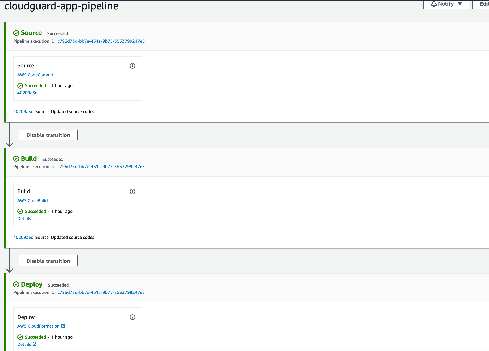 

## 6. Verification of CloudGuard protection

On AWS Console, go to "Lambda", and the function that we've enabled the protection on. Verify that a layer has been added to the function.

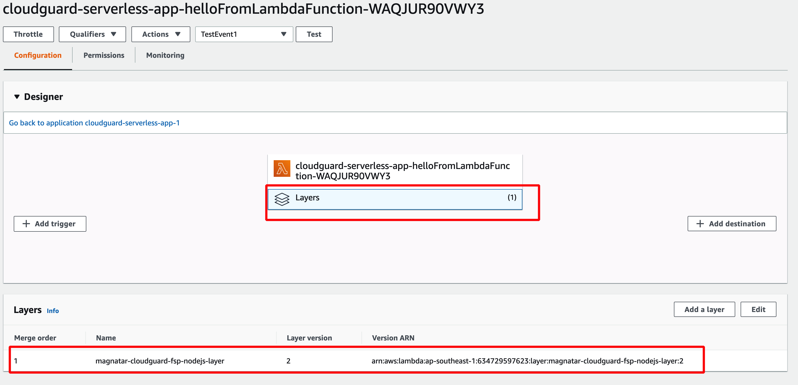 


You can log on to your CloudGuard console, and go to the Serverless module or Protected Assets. Check your Lambda function.

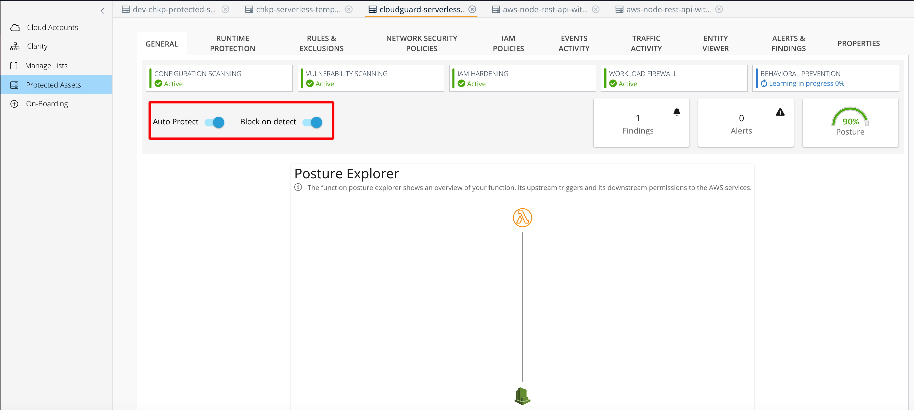 

## Code Injection Attack Simulation

In a scenario where you expose Lambda function via HTTP endpoints provided by API Gateway, your serverless application is vulnerable to numerous code injection attacks. If you've turned on Function Self-Protection (FSP) on CloudGuard for that particular Lambda function, your application can be secured and protected by CloudGuard workload protection. CloudGuard will block active code injection attacks when the application is in runtime.

In below example, I've simulated a simple code injection attack using curl. And you can see that the attack wasn't successful. (Internal Server Error)

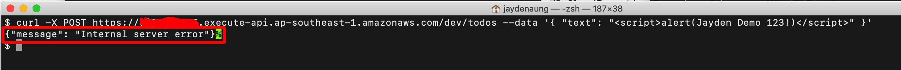 

> On CloudGuard, you can see that the code injection attack was **blocked** by CloudGuard. 

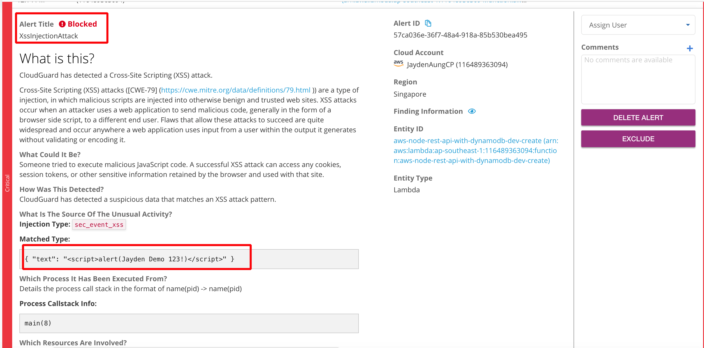 

## Cleanup

To delete the sample application that you created, use the AWS CLI. Assuming you used your project name for the stack name, you can run the following:

### Delete the pipeline

```bash
aws codepipeline delete-pipeline --name MyPipeline
```

```bash
aws cloudformation delete-stack --stack-name cloudguard-serverless-app
```

## Resources


